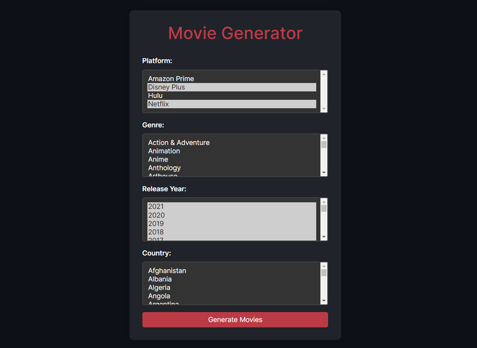
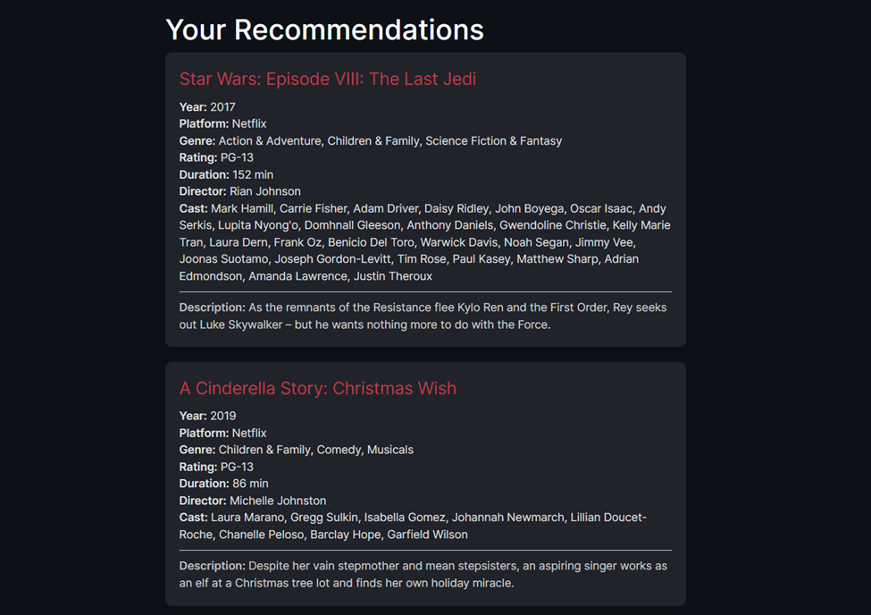
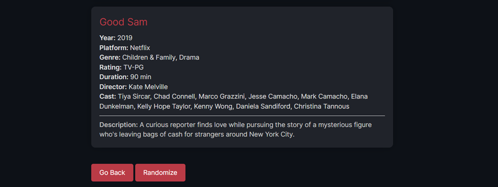

# Movie Recommender

## Overview
This Movie Recommender is a web application built using Django, Python, and HTML. It allows users to discover 
randomized movie recommendations based on their selected preferences, such as genre, release year, country and
streaming platform.

## Key Features
1. Input your preferences: Choose genres, release years, countries and streaming platforms to filter movie recommendations. 
2. Get personalized recommendations: The recommender system matches your inputted preferences with the available movie database and generates three random movie suggestions.
3. Explore detailed movie information: View movie titles, directors, cast, ratings, durations, and descriptions for each recommendation.

## Dataset Collection and Preprocessing
The project utilizes movie datasets from four popular streaming platforms: Netflix, Amazon Prime, Hulu, and Disney Plus.
The datasets were sourced from Kaggle and contained a total of 22,998 entries. The data was preprocessed, cleaned, and 
transformed to create a consolidated dataset with 16,165 entries.

The project includes exploratory data analysis (EDA) with various data visualizations for the dataset. EDA revealed 
that the dataset contains diverse movies spanning from 1920 to 2021, with genres ranging from Drama to Comedy. 
The dataset has a total of 39 unique genres. Some of the most common genres include Drama, Comedy, Action & Adventure, 
Thriller, and Documentary.  This comprehensive analysis laid the groundwork for building an effective system.

## Implementation
The project is implemented using Django, a Python web framework, for the backend and HTML for the user interface. 
The recommendation technique used in this project is a content-based filtering approach. It matches user-selected 
preferences with movies in the database and returns random movie suggestions that fit the criteria.

## Installation and Usage
1. Clone the repository to your local machine/preferred IDE (i.e. PyCharm).
2. Install the required dependencies using "pip install -r requirements.txt" in the terminal. 
3. Run the Django development server using python manage.py runserver in the terminal. 
4. Open your web browser and navigate to http://localhost:8000/generator to access the Movie Recommender.

## References
1. https://www.kaggle.com/datasets/shivamb/amazon-prime-movies-and-tv-shows
2. https://www.kaggle.com/datasets/shivamb/disney-movies-and-tv-shows
3. https://www.kaggle.com/datasets/shivamb/hulu-movies-and-tv-shows
4. https://www.kaggle.com/datasets/shivamb/netflix-shows
